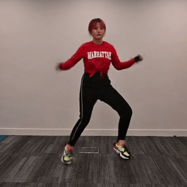
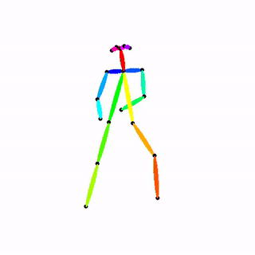
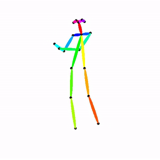

## Music-oriented Dance Video Synthesis with Pose Perceptual Loss

Pytorch implementation for the paper:

The demo video is shown at: https://youtu.be/E8tgBFE6pEA

This repo is under construction and the code and data will come soon.

### Some Demo:

More samples can be seen in demo video.

### Dataset:
As state in the paper, we collect 60 videos in total, and divide them into 2 part according to the cleaness of the skeletons.

The clean part(40 videos):
https://drive.google.com/file/d/1o79F2F7-dZ7Cvpzf6hsVMwvfNg9LM3_K/view?usp=sharing

The noisy part(20 videos):
https://drive.google.com/file/d/1pZ3JszX7393dQwm6x6bxxbiKb0wLIJGE/view?usp=sharing

To use the dataset, please refer the notebook "dataset/usage_dataset.ipy"

To support further study, we also provide other collected data which is not used in the paper(limit to time),

Ballet:

Popping:

Boy_kpop:
https://drive.google.com/file/d/14-kEdudvaGLSapAr4prp4D67wzyACVQt/view?usp=sharing

Besides, we also provide the BaiduNetDisk version:

(includes all the dataset)

